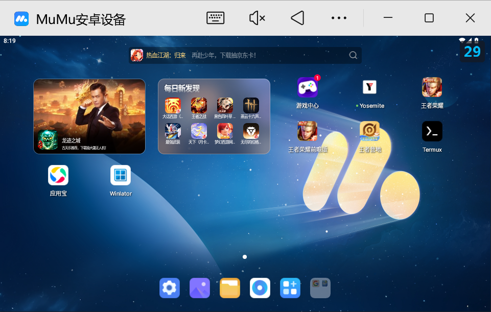

1. [Done]在控制角色移动函数部分增加输出,矫正按键位置,测试adb位置
2. [Done][前方移动权重增加]增加移动权重, 让角色更倾向于上线,删除其他移动权重
3. [done][需要训练,提供的模型是图像识别,不是对抗模型]确定这个模型真的有让角色移动和对战的能力吗？是否需要训练新的模型.
4. [done]改用airtest提供接口,而非windows窗口截图
5. [done]改用airtest进行touch,采用autowzry进行控制
6. [done][支持960x540直接从MuMu模拟器的窗口读取,相对坐标计算的位置]调整分辨率
7. 打包成库,在autowzry中调用此库/训练此库
8. [Done]采用便携版Python3.10重新配置环境,并编写一键安装脚本[Q_INSTALL.md](Q_INSTALL.md)
9. 这个项目真的有训练的能力吗?需要阅读确定


## 当前项目的训练逻辑验证


## [1/2]autowzry开发计划
* ~~在[autowzry](https://github.com/cndaqiang/autowzry)中开发死亡检查，以及基于opencv的胜利和失败判断,需要替换：ppocronnx吗？~~
* ~~胜利状态检查~~
* 现有的OCR模型,多基于pytorch,onnxruntime(依赖cuda tool kit cudnn等)和tesseract(依赖tesseract引擎), 完整安装占用体积(依赖+模型文件)
* 可以在airtest_mobile或者其他库写一个基于~~onnxruntime~~pytorch及衍生包的库(如EasyOCR), 作为学习用/拓展gpu版的autowzry使用,无法通过npm/pypi发布闭源包
* **但是最简答的方案是:写一个截图代码,将游戏调整到对应界面,回车截图,直接判断元素在不在即可,无需训练**,缺点就是王者在更新界面时,要用新的图片去识别, 这样不依赖任何环境. *最简单的,只要不存在对战按钮、不存在恢复、不存在回城闪现等就是游戏结束了* 使用`concurrent.futures`并行判断就快了
* 胜利还是失败对于训练没有影响,死亡和存活才重要?


## [done] Airtest适配计划
* [done]接入[autowzry](https://github.com/cndaqiang/autowzry), 判断对战状态, 替换掉onnx模型
* [done]使用[airtest_mobileauto](https://github.com/cndaqiang/airtest_mobileauto)进行截图操作,替换掉windows窗口截图
* [done,只有android_tool.py中涉及,已替换]使用[airtest_mobileauto](https://github.com/cndaqiang/airtest_mobileauto)进行touch操作,替换掉adb命令操作
* 要先升级opencv和numpy吗？


## 详细的开发细节

### [done]OCR相关库阅读

* opencv-python 从 4.10.0 起，需要 numpy > 2.0
* opencv-python 4.5, 支持numpy > 1.3
* 不同库均依赖于opencv的老版本(4.5)因此,会限制其只能用于numpy<2.0
* GPT: OpenCV 4.5 → 4.10 的跨度看似大，但实际上它仍属于 OpenCV 4.x 系列内部的小版本升级，并未引入破坏性接口变化，因此总体上可以 平滑升级。
* 自py3.9开始,默认应该就是`opencv4.5numpy2.x`，虽然也可以安装老版本
* **或许,后面可以修改airtest等库的依赖,直接采用opencv5.10和numpy2**

#### 限制个别库的版本安装.等待测试
```
pip install A -c constraints.txt
```

constraints.txt
```
numpy==2.1.1
opencv-python==4.10.0.84
```

#### airtest对于opencv的依赖

```
numpy <2.0
opencv-contrib-python <=4.6.0.66,>=4.4.0.46
```

#### ppocronnx库的处理
[ppocr-onnx](https://pypi.org/project/ppocr-onnx/)利用 onnxruntime 及 PaddleOCR 提供的模型, 对图片中的文字进行检测与识别.

```
from ppocronnx.predict_system import TextSystem
import cv2

text_sys = TextSystem()

# 识别单行文本
res = text_sys.ocr_single_line(cv2.imread('single_line_text.png'))
print(res)

# 批量识别单行文本
res = text_sys.ocr_lines([cv2.imread('single_line_text.png')])
print(res[0])

# 检测并识别文本
img = cv2.imread('test.png')
res = text_sys.detect_and_ocr(img)
for boxed_result in res:
    print("{}, {:.3f}".format(boxed_result.ocr_text, boxed_result.score)
```

依赖,并未限制版本,所以会导致安装最新的opencv
```
onnxruntime
numpy
opencv-python
shapely
pyclipper
pillow
requests
```

#### onnxRunner.py
* 这个原项目封装的库,基于opencv和 onnxruntime 开发，进行推理.
* 用于加载图片模型,识别对战,死亡状态.

#### onnxruntime
**onnxruntime是微软官方提供的 ONNX 模型推理引擎（runtime），用于加载和执行 .onnx 模型**

* `onnxruntime-gpu`自身不再自带完整 CUDA 库, *它依赖系统里已有的 NVIDIA 驱动、CUDA toolkit 和 cuDNN。*
* 它只内置了和特定版本匹配的 CUDA kernel。所以要安装对应版本

### 截图操作拆解
#### pyqt截图窗口内容

原作者，这里采用了PyQt 来截图，兼容透明层、DPI 缩放、多屏环境，如果用 win32ui 自己截图，这些细节要自己处理，否则截图可能模糊或偏移。

但是这种方式会包含标题,如


```
import cv2
import numpy as np
import win32gui
from PyQt5.QtGui import QImage
from PyQt5.QtWidgets import QApplication
    def screenshot_window(self):
        """
        截取指定窗口的内容并返回图像数据。

        参数:
        window_name (str): 窗口标题的部分或全部字符串。

        返回:
        np.ndarray: 截图的图像数据，如果窗口未找到则返回 None。
        """
        try:
            # 获取窗口句柄
            handle = win32gui.FindWindow(None, args.window_title)
            if handle == 0:
                raise Exception(f"窗口 '{args.window_title}' 未找到。")

            # 初始化 QApplication
            app = QApplication(sys.argv)
            screen = QApplication.primaryScreen()

            # 截取指定窗口的内容
            img = screen.grabWindow(handle).toImage()

            # 将 QImage 转换为 numpy 数组
            img = img.convertToFormat(QImage.Format.Format_RGB32)
            width = img.width()
            height = img.height()
            ptr = img.bits()
            ptr.setsize(height * width * 4)
            arr = np.array(ptr).reshape(height, width, 4)
            arr = cv2.cvtColor(arr, cv2.COLOR_BGRA2BGR)

            return arr
        except Exception as e:
            print(e)
            return None
```

#### airtest截图窗口内容
airtest的截图返回就是opencv数组,无需处理直接截图


```
from airtest_mobileauto.control import deviceOB, Settings
class AndroidTool:
    def __init__(self, scrcpy_dir="scrcpy-win64-v2.0",airtest_config=""):
        self.airtest_config = airtest_config
        self.airtest = False
        if len(self.airtest_config) > 0:
            print(f"---> AndroidTool: airtest_config={airtest_config}")
            print(f"---> cndaqiang: 将基于airtest执行")
            self.airtest_init()
        self.scrcpy_dir = scrcpy_dir
        self.device_serial = args.iphone_id
        self.actual_height, self.actual_width = self.get_device_resolution()
        self.executor = concurrent.futures.ThreadPoolExecutor(max_workers=3)
        #self._show_action_log = False
        self._show_action_log = True #cndaqang debug

    def airtest_init(self):
        Settings.Config(self.airtest_config)
        # copy from autowzry
        # 静态资源
        current_dir = os.path.dirname(os.path.abspath(__file__))
        assets_dir = os.path.join(current_dir, 'assets')
        Settings.figdirs.append(assets_dir)
        seen = set()
        Settings.figdirs = [x for x in Settings.figdirs if not (x in seen or seen.add(x))]
        #
        # device
        self.mynode = Settings.mynode
        self.totalnode = Settings.totalnode
        self.totalnode_bak = self.totalnode
        self.LINK = Settings.LINK_dict[Settings.mynode]
        self.移动端 = deviceOB(mynode=self.mynode, totalnode=self.totalnode, LINK=self.LINK)
        self.移动端.连接设备()
        self.airtest = True
    #...
    def screenshot_airtest(self):
        """
        使用 Airtest 截取屏幕并返回图像数据。

        返回:
        np.ndarray: 截图的图像数据。
        """
        try:
            arr = self.移动端.device.snapshot()
            # cndaqiang debug
            cv2.imwrite("screenshot_airtest.png", arr)
            #
            return arr
        except Exception as e:
            print(e)
            return None
```

