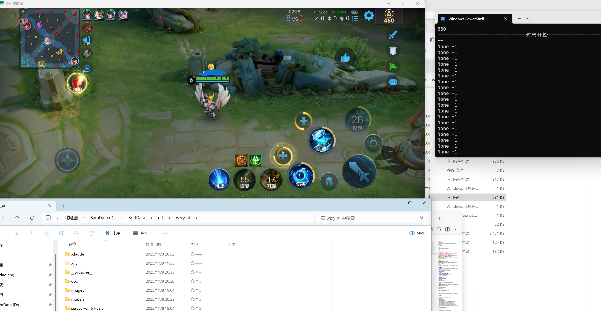

# Note by cndaqiang

## 致谢

感谢 [Claude](https://claude.ai) (Anthropic) 在本项目环境配置和依赖管理中提供的技术支持。

特别感谢 [AnyRouter](https://anyrouter.top/register?aff=TFIa) 提供的免费 Claude API 服务，让我们能够顺利完成开发工作。

## 配置环境
### 需要安装cuda和cudnn
```
https://developer.download.nvidia.com/compute/cuda/12.0.0/local_installers/cuda_12.0.0_527.41_windows.exe
https://developer.download.nvidia.com/compute/cudnn/9.15.0/local_installers/cudnn_9.15.0_windows.exe
```

### Python 3.10
```
conda create --name wzry_ai python=3.10
conda activate wzry_ai
```


### 依赖

**重要说明：** 由于 ppocr-onnx 的依赖会自动安装最新版 opencv-python（需要 NumPy 2.x），而项目使用的 opencv-contrib-python 4.9.0.80 只兼容 NumPy 1.x，因此需要按以下步骤安装以避免版本冲突：

#### 方案一：标准安装（推荐）
```bash
# 1. 先安装 opencv-contrib-python（会自动安装 NumPy，可能是 2.x）
python -m pip install opencv-contrib-python==4.9.0.80

# 2. 立即降级 NumPy 到 1.x（重要！否则 cv2 无法正常工作）
python -m pip install "numpy<2"

# 3. 使用 --no-deps 安装 ppocr-onnx 避免自动安装冲突的 opencv-python
python -m pip install ppocr-onnx==0.0.3.9 --no-deps

# 4. 安装其他依赖
python -m pip install PyQt5==5.15.10 pywin32==306 keyboard==0.13.5 matplotlib==3.9.2 filelock==3.13.1

# 5. 安装 ppocr-onnx 的其他依赖（不包括 opencv-python）
python -m pip install onnxruntime shapely pyclipper pillow requests

# 6. 安装 PyTorch (CUDA 11.8)
python -m pip install torch torchvision torchaudio --index-url https://download.pytorch.org/whl/cu118

# 7. 安装 onnxruntime-gpu (CUDA 12) - 可选
# 注意：如果系统未安装 CUDA 12.x，会有警告但会自动回退到 CPU，不影响使用
# 如需完整 GPU 支持，需安装 CUDA Toolkit 12.x 和 cuDNN 9.x
python -m pip install onnxruntime-gpu --extra-index-url https://aiinfra.pkgs.visualstudio.com/PublicPackages/_packaging/onnxruntime-cuda-12/pypi/simple/

# 或者使用纯 CPU 版本（无警告，适合开发调试）：
# python -m pip install onnxruntime
```

#### 方案二：一键脚本安装
将以下命令复制到 PowerShell 执行：
```powershell
python -m pip install opencv-contrib-python==4.9.0.80 && `
python -m pip install "numpy<2" && `
python -m pip install ppocr-onnx==0.0.3.9 --no-deps && `
python -m pip install PyQt5==5.15.10 pywin32==306 keyboard==0.13.5 matplotlib==3.9.2 filelock==3.13.1 onnxruntime shapely pyclipper pillow requests && `
python -m pip install torch torchvision torchaudio --index-url https://download.pytorch.org/whl/cu118 && `
python -m pip install onnxruntime-gpu --extra-index-url https://aiinfra.pkgs.visualstudio.com/PublicPackages/_packaging/onnxruntime-cuda-12/pypi/simple/
```

#### 验证安装
```bash
# 验证核心库可以正常导入并使用
python -c "import cv2; import numpy as np; print('NumPy:', np.__version__); print('Has cvtColor:', hasattr(cv2, 'cvtColor')); print('All imports successful!')"
```

#### 问题说明

**依赖冲突问题：**
- **问题根源：** ppocr-onnx 0.0.3.9 依赖声明中包含 `opencv-python`（无版本限制），pip 会自动安装最新版（4.12.x），该版本要求 NumPy 2.x
- **为什么会冲突：** opencv-contrib-python 4.9.0.80 虽然能安装 NumPy 2.x，但是运行时会出错（cv2 模块无法正常加载），必须使用 NumPy 1.x
- **解决方案：**
  1. 先安装 opencv-contrib-python（允许它安装 NumPy 2.x）
  2. 立即降级 NumPy 到 1.x
  3. 使用 `--no-deps` 安装 ppocr-onnx，阻止其自动安装 opencv-python
- **关键点：** opencv-contrib-python 安装后必须立即降级 NumPy，否则 cv2.cvtColor 等函数无法使用

**ONNX Runtime GPU 警告问题：**
- **警告内容：** `Failed to create CUDAExecutionProvider. Require cuDNN 9.* and CUDA 12.*`
- **原因：** PyTorch 自带 CUDA 库，但 onnxruntime-gpu 需要系统安装 CUDA Toolkit 12.x 和 cuDNN 9.x
- **性能影响：**
  - 当前 ONNX 推理在 CPU 上运行（约 20-50 ms/帧）
  - GPU 加速后推理速度约 2-5 ms/帧（**提升 5-10 倍**）
  - **对于实时游戏 AI 项目，建议安装 CUDA 12 以获得最佳性能**
- **解决方案：**
  - **推荐：** 安装 CUDA Toolkit 12.x 和 cuDNN 9.x（详见下方"安装 CUDA 12"章节）
  - 替代方案：使用 CPU 版本（开发调试可用，但推理较慢）


## 配置模拟器
按照 doc/模拟器配置说明.md 进行配置
* 开启root权限(真的需要吗?todo)
* adb, 2400*1080(真的需要吗?是按键位置需要,还是训练的模型需要?todo)


连接模拟器之后，就可以双击打开scrcpy了,获得窗口标题如`SM-S9210`(目前好像是基于窗口识别的,基于adb的识别速度应该会慢,没有基于adb适配的计划?notdo)
```
PS D:\SoftData\git\wzry_ai\scrcpy-win64-v2.0> .\adb.exe connect 127.0.0.1:5555
connected to 127.0.0.1:5555
```

修改默认参数的adb,window_title
```
def get_args():
    parser = argparse.ArgumentParser()
    parser.add_argument('--iphone_id', type=str, default='127.0.0.1:5555', help="iphone_id")
    parser.add_argument('--real_iphone', type=bool, default=False, help="real_iphone")
    parser.add_argument('--window_title', type=str, default='SM-S9210', help="window_title")
    parser.add_argument('--device_id', type=str, default='cuda:0', help="device_id")
    parser.add_argument('--memory_size', type=int, default=10000, help="Replay memory size")
    parser.add_argument('--batch_size', type=int, default=64, help="Batch size for training")
    parser.add_argument('--learning_rate', type=float, default=0.001, help="Learning rate")
    parser.add_argument('--gamma', type=float, default=0.99, help="Discount factor")
    parser.add_argument('--epsilon', type=float, default=1.0, help="Initial exploration rate")
    parser.add_argument('--epsilon_decay', type=float, default=0.995, help="Exploration rate decay")
    parser.add_argument('--epsilon_min', type=float, default=0.01, help="Minimum exploration rate")
    parser.add_argument('--model_path', type=str, default="src/wzry_ai.pt", help="Path to the model to load")
    parser.add_argument('--num_episodes', type=int, default=10, help="Number of episodes to collect data")
    parser.add_argument('--target_update', type=int, default=10, help="Number of episodes to collect data")
```

## 运行
``` 
& "$env:USERPROFILE\miniconda3\shell\condabin\conda-hook.ps1"
conda activate "$env:USERPROFILE\miniconda3"
conda activate wzry_ai
python train.py

# 暂停，方便查看结果
$timer=Start-Job {Start-Sleep 20}; Write-Host "Press any key to continue..."; while(-not [console]::KeyAvailable -and (Get-Job -Id $timer.Id).State -eq 'Running'){Start-Sleep 0.1}; Stop-Job $timer
```

运行结果


## todo
* 或许后续可以采用[autowzry](https://github.com/cndaqiang/autowzry)进行王者操控, 再进入对战页面后, 采用该项目进行对战.
* 目前该项目的模型还有进步空间.